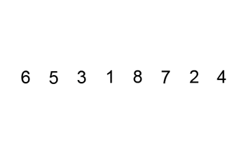
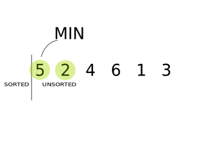

# 8. 정렬 (sort)

## 정렬

* 핸드폰에 연락처를 보면 가나다 순서대로 보여진다. 
* 폴더안에 파일을 이름, 확장자, 수정 날짜 등의 기준으로 순서를 맞춰서 볼 수있다.
* 이렇게 여러개의 데이터를 특정한 규칙대로 순서대로 나타나게 하는 것을 **정렬**, **Sort** 이라고 한다. 
* 대부분의 데이터는 순서없이 저장이 되기 때문에, 이 데이터를 순서대로 정렬 하는 과정은 매우 빈번하게 사용된다. 
* 그리고 이를 효율적이고 빠르게 하기 위해서 여러 형태의 정렬 알고리즘이 존재한다. 

# 배열을 통한 정렬
* 아래와 같이 int 형 배열에 순서 없이 들어 있는 숫자가 있다.

	| 4 | 3 | 5 | 1 | 2 |
	|----|----|----|----|----|
	
* 오름 차순으로 정렬 하면 아래와 같다. 

	|  1 | 2 | 3 | 4 | 5 |
	|----|----|----|----|---|
	
* 내림 차순으로 정렬 하면 아래와 같다. 

	|  5 | 4 | 3 | 2 | 1 |
	|----|----|----|----|---|
	
* 지금 까지 배운 내용을 복습하기 매우 좋은 문제이다. 
* 정렬을 하는 간단한 알고리즘 중 가장 대표적인 세가지 알고리즘을 소개 한다. 

## 버블 소트 (bubble sort)
* 숫자가 하나씩 떠오르듯이 수를 하나씩 정렬해 준다고해서 버블 소트이다. 

 

## 선택 소트

## 삽입 소트

[소스보기](sorting.c)